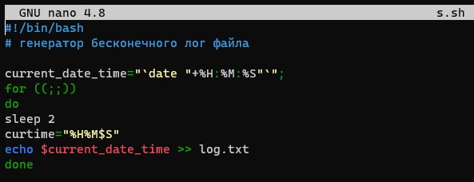
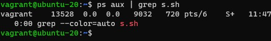
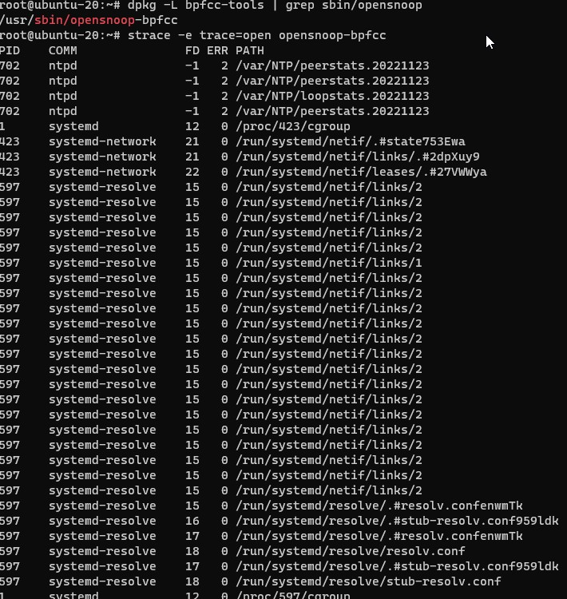
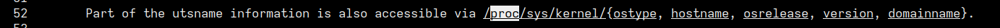
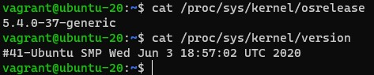
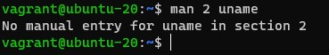
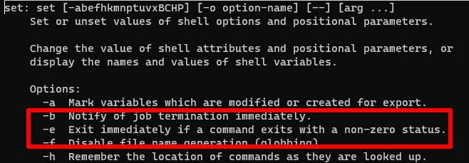

# Домашнее задание к занятию "3.3. Операционные системы. Лекция 1"

Задание
Какой системный вызов делает команда cd?

1.В прошлом ДЗ мы выяснили, что cd не является самостоятельной программой, это shell builtin, поэтому запустить strace непосредственно на cd не получится. Тем не менее, вы можете запустить strace на /bin/bash -c 'cd /tmp'. В этом случае вы увидите полный список системных вызовов, которые делает сам bash при старте.
Вам нужно найти тот единственный, который относится именно к cd. Обратите внимание, что strace выдаёт результат своей работы в поток stderr, а не в stdout.
    
_/bin/bash -c 'cd /tmp' вызывает команду chdir("/tmp")_
    

2.Попробуйте использовать команду file на объекты разных типов в файловой системе. Например:

`vagrant@netology1:~$ file /dev/tty
/dev/tty: character special (5/0)
vagrant@netology1:~$ file /dev/sda
/dev/sda: block special (8/0)
vagrant@netology1:~$ file /bin/bash
/bin/bash: ELF 64-bit LSB shared object, x86-64`
Используя strace выясните, где находится база данных file, на основании которой она делает свои догадки.

_Команда file позволяет узнать тип данных, которые на самом деле содержатся внутри документа. Думаю команда file обращается к файлу /usr/share/misc/magic.mgc чтобы определить тип данных._

3.Предположим, приложение пишет лог в текстовый файл. Этот файл оказался удален (deleted в lsof), однако возможности сигналом сказать приложению переоткрыть файлы или просто перезапустить приложение – нет. Так как приложение продолжает писать в удаленный файл, место на диске постепенно заканчивается. Основываясь на знаниях о перенаправлении потоков предложите способ обнуления открытого удаленного файла (чтобы освободить место на файловой системе).

_Создал скрипт для генерации лога_

_для демонстрации последовательности команд создал скрипт_

_результат работы сриптов в окнах screen_

_С помощью обнуления процесса и перенаправления в файл, освободил место на диске._

4.Занимают ли зомби-процессы какие-то ресурсы в ОС (CPU, RAM, IO)?

_Зомби процессы не потребляют ресурсы_

5.В iovisor BCC есть утилита opensnoop:

`root@vagrant:~# dpkg -L bpfcc-tools | grep sbin/opensnoop
/usr/sbin/opensnoop-bpfcc
`
На какие файлы вы увидели вызовы группы open за первую секунду работы утилиты? Воспользуйтесь пакетом bpfcc-tools для Ubuntu 20.04. Дополнительные сведения по установке.

6.Какой системный вызов использует uname -a? Приведите цитату из man по этому системному вызову, где описывается альтернативное местоположение в /proc, где можно узнать версию ядра и релиз ОС.

_Ответ на вопрос где есть альтернативное местоположение в /proc, где можно узнать версию ядра и релиз ОС расположен во второй секции `man 2 uname`. Прочесть мануал удалось в RedOS_

_По какой то причине в Ubuntu нет этой секции_

7.Чем отличается последовательность команд через ; и через && в bash? Например:

`root@netology1:~# test -d /tmp/some_dir; echo Hi
Hi
root@netology1:~# test -d /tmp/some_dir && echo Hi
root@netology1:~#
`

_Оператор ; выполняет несколько команд одновременно последовательно и обеспечивает вывод без зависимости от успеха и отказа других команд, таких как &&(AND оператор), который прерывает выполнение если не выполняется условие._ 

Есть ли смысл использовать в bash &&, если применить set -e?

_Думаю нет смысла использовать && вместе с set -e, так как у них схожий функционал_

8.Из каких опций состоит режим bash set -euxo pipefail и почему его хорошо было бы использовать в сценариях?

_-e Немедленный выход, если команда завершается с ненулевым статусом. 
-u Рассматривает неустановленные переменные как ошибку при замене.
-x Выводит команды и их аргументы по мере их выполнения.
-o pipefail — возвращает значение последней команды для выхода с ненулевым статусом или ноль, если ни одна команда не вышла с ненулевым статусом. Удобно использовать в сценариях, так как логирует выполнение команд, для последующего анализа выполнения скрипта._

9.Используя -o stat для ps, определите, какой наиболее часто встречающийся статус у процессов в системе. В man ps ознакомьтесь (/PROCESS STATE CODES) что значат дополнительные к основной заглавной буквы статуса процессов. Его можно не учитывать при расчете (считать S, Ss или Ssl равнозначными).

Мануал по ps показывает несколько кодов состояния процесса

_На моей системе команда `ps -o stat` показывает: 
Ss - прерываемый режим сна (ожидание завершения события)
R+ запущенный или ожидающий запуска (в очереди выполнения), находится в группе первоочередных процессов._

