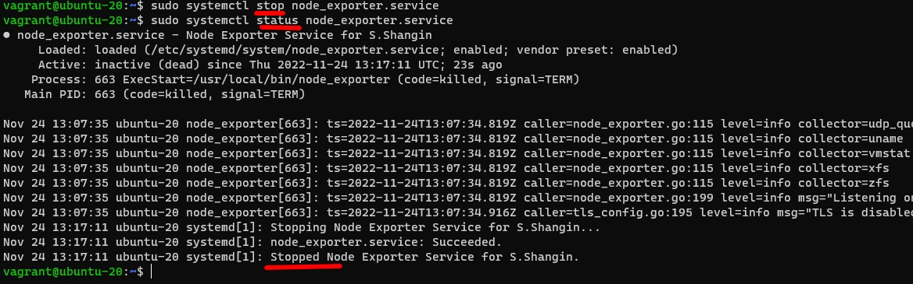

# Домашнее задание к занятию "3.4. Операционные системы. Лекция 2"

Цель задания
В результате выполнения этого задания вы:

Познакомитесь со средством сбора метрик node_exporter и средством сбора и визуализации метрик NetData. Такого рода инструменты позволяют выстроить систему мониторинга сервисов для своевременного выявления проблем в их работе.
Построите простой systemd unit файл для создания долгоживущих процессов, которые стартуют вместе со стартом системы автоматически.
Проанализируете dmesg, а именно часть лога старта виртуальной машины, чтобы понять, какая полезная информация может там находиться.
Поработаете с unshare и nsenter для понимания, как создать отдельный namespace для процесса (частичная контейнеризация).

### Чеклист готовности к домашнему заданию

Убедитесь, что у вас установлен Netdata c ресурса с предподготовленными пакетами или sudo apt install -y netdata.

### Инструменты/ дополнительные материалы, которые пригодятся для выполнения задания

Документация по systemd unit файлам
Документация по параметрам sysctl

## Задание

1.На лекции мы познакомились с node_exporter. В демонстрации его исполняемый файл запускался в background. Этого достаточно для демо, но не для настоящей production-системы, где процессы должны находиться под внешним управлением. Используя знания из лекции по systemd, создайте самостоятельно простой unit-файл для node_exporter:

* поместите его в автозагрузку,
* предусмотрите возможность добавления опций к запускаемому процессу через внешний файл (посмотрите, например, на systemctl cat cron),
* удостоверьтесь, что с помощью systemctl процесс корректно стартует, завершается, а после перезагрузки автоматически поднимается.

_Установлен_

_unit-file_

_автозагрузка_

_процесс корректно стартует_

_завершается_

_после ребута запускается_

2.Ознакомьтесь с опциями node_exporter и выводом /metrics по-умолчанию. Приведите несколько опций, которые вы бы выбрали для базового мониторинга хоста по CPU, памяти, диску и сети.

_для базового мониторинга хоста по CPU:_
_node_cpu_seconds_total{cpu="0",mode="idle"} 1070.44
node_cpu_seconds_total{cpu="0",mode="system"} 4.27
node_cpu_seconds_total{cpu="0",mode="user"} 3.31

... памяти
node_memory_MemAvailable_bytes 6.96397824e+08
node_memory_MemFree_bytes 6.16710144e+08
node_memory_MemTotal_bytes 9.60745472e+08

... диску (ам)
node_disk_io_time_seconds_total{device="dm-0"} 9.284
node_disk_read_bytes_total{device="dm-0"} 1.99144448e+08
node_disk_read_time_seconds_total{device="dm-0"} 67.364
node_disk_write_time_seconds_total{device="dm-0"} 9.684000000000001

... сети (для всех интерфесов).
node_network_receive_errs_total{device="eth0"} 0
node_network_receive_bytes_total{device="eth0"} 336933
node_network_speed_bytes{device="eth0"} 1.25e+08
node_network_transmit_bytes_total{device="eth0"} 99680
node_network_transmit_errs_total{device="eth0"} 0_

3.Установите в свою виртуальную машину Netdata. Воспользуйтесь готовыми пакетами для установки (sudo apt install -y netdata).
После успешной установки:
* в конфигурационном файле /etc/netdata/netdata.conf в секции [web] замените значение с localhost на bind to = 0.0.0.0,
* добавьте в Vagrantfile проброс порта Netdata на свой локальный компьютер и сделайте vagrant reload:
`config.vm.network "forwarded_port", guest: 19999, host: 19999`

_настройки в Vagrantfile_

_в конфигурационном файле /etc/netdata/netdata.conf_

После успешной перезагрузки в браузере на своем ПК (не в виртуальной машине) вы должны суметь зайти на localhost:19999. Ознакомьтесь с метриками, которые по умолчанию собираются Netdata и с комментариями, которые даны к этим метрикам.

 _Проброс на localhost не сработал. Не мог понять почему пока не нашел ответ на аналогичную проблему от сотрудника Hashicorp. Пока такой проброс в связке Vagrant Hyper-V не реализован. Как раз мой случай, я поставил связал Vagrant с Hyper-V, так Virtualbox установить на домашнем компьютере с Windows 10 Home не удалось_  

_Однако программа работает по адресу виртуальной машины._

4.Можно ли по выводу `dmesg` понять, осознает ли ОС, что загружена не на настоящем оборудовании, а на системе виртуализации?

_ОС все понимает_

5.Как настроен sysctl `fs.nr_open` на системе по-умолчанию? Определите, что означает этот параметр. Какой другой существующий лимит не позволит достичь такого числа (`ulimit --help`)?

_fs.nr_open - ограничение на количество открытых дескрипторов в системе.
Команда ulimit Обеспечивает контроль над ресурсами, доступными оболочке и процессам
он создает в системах, которые допускают такой контроль.
Если задан ЛИМИТ, то это новое значение указанного ресурса; специальные ПРЕДЕЛЬНЫЕ значения мягкий", жесткий" и неограниченный" обозначают
текущий мягкий лимит, текущий жесткий лимит и отсутствие лимита соответственно._

6.Запустите любой долгоживущий процесс (не `ls`, который отработает мгновенно, а, например, sleep 1h) в отдельном неймспейсе процессов; покажите, что ваш процесс работает под PID 1 через nsenter. Для простоты работайте в данном задании под root (`sudo -i`). Под обычным пользователем требуются дополнительные опции (`--map-root-user`) и т.д.

7.Найдите информацию о том, что такое `:(){ :|:& };:`. Запустите эту команду в своей виртуальной машине Vagrant с Ubuntu 20.04 (это важно, поведение в других ОС не проверялось). Некоторое время все будет "плохо", после чего (минуты) – ОС должна стабилизироваться. Вызов `dmesg` расскажет, какой механизм помог автоматической стабилизации.
Как настроен этот механизм по-умолчанию, и как изменить число процессов, которое можно создать в сессии?

_Функция `:(){ :|:& };:` параллельно пускает два своих экземпляра. Каждый пускает ещё по два и т.д. При отсутствии лимита на число процессов машина быстро исчерпывает физическую память и уходит в своп._

