# Домашнее задание к занятию "3.5. Файловые системы"

1.Узнайте о sparse (разряженных) файлах.

_Наверное полезно для резервных копий виртуальных машин. Но текстовые файлы не очень уменьшает._

`vagrant@ubuntu-20:~$ ls -l log
-rw-rw-r-- 1 vagrant vagrant 5431486959 Nov 22 17:33 log
vagrant@ubuntu-20:~$ cp --sparse=always log sparse-log
vagrant@ubuntu-20:~$ ls -l sparse-log
-rw-rw-r-- 1 vagrant vagrant 5431486959 Nov 26 03:19 sparse-log
vagrant@ubuntu-20:~$
`

2.Могут ли файлы, являющиеся жесткой ссылкой на один объект, иметь разные права доступа и владельца? Почему?

_Не могут. Жесткая ссылка на файл является зеркальной копией объекта, наследует его права, владельца и группу, inode._

3.Сделайте vagrant destroy на имеющийся инстанс Ubuntu. Замените содержимое Vagrantfile следующим:
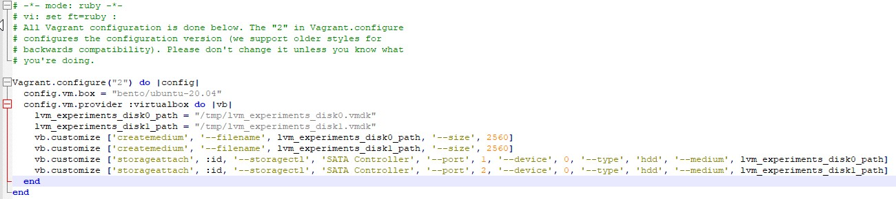
Данная конфигурация создаст новую виртуальную машину с двумя дополнительными неразмеченными дисками по 2.5 Гб.

Готово. Проверим диски:
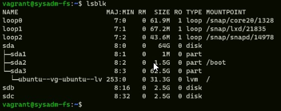

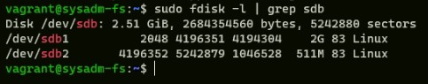

5.Используя `sfdisk`, перенесите данную таблицу разделов на второй диск.

_Сначала создаем дамп диска и потом восстанавливаем его на второй диск. Это копирует UUID без изменений, а не генерирует новые. Таким образом, новый диск - это клон оригинала, а не просто еще один диск с такой же разметкой._ 

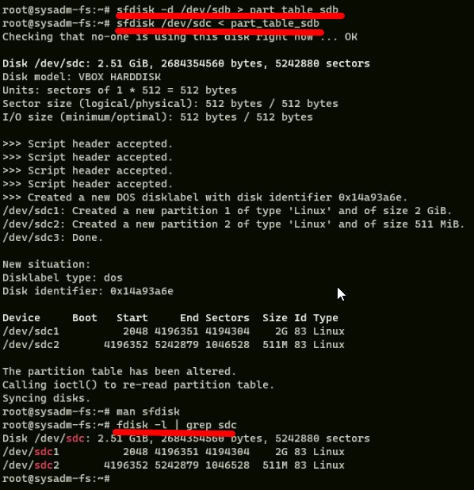

_Проверка показала, что второй диск имеет такую же таблицу разделов._

6.Соберите mdadm RAID1 на паре разделов 2 Гб.

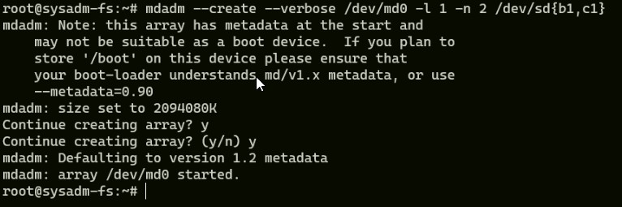

7.Соберите mdadm RAID0 на второй паре маленьких разделов.

_Собрал второй райд и посмотрел результат_

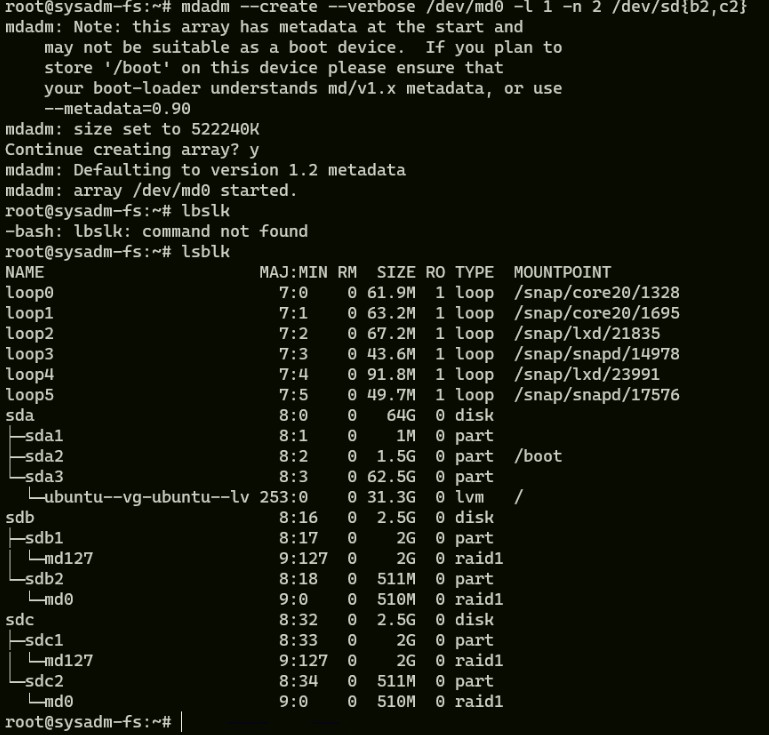

8.Создайте 2 независимых PV на получившихся md-устройствах.

_Сначала не получилось создать md1_
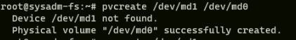
_Потом обратил внимание, что райд1 на md127 собрался_
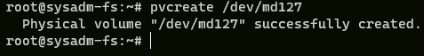

9.Создайте общую volume-group на этих двух PV.

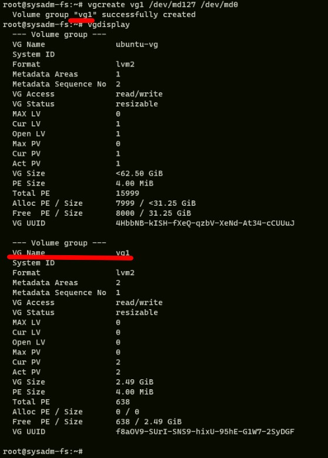

10.Создайте LV размером 100 Мб, указав его расположение на PV с RAID0.

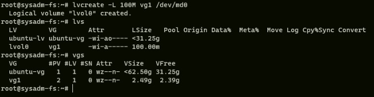

11.Создайте mkfs.ext4 ФС на получившемся LV.

_создал файловую систему ext4_
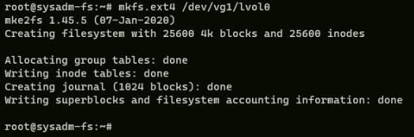

12.Смонтируйте этот раздел в любую директорию, например, /tmp/new.

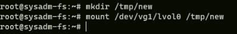

13.Поместите туда тестовый файл, например wget https://mirror.yandex.ru/ubuntu/ls-lR.gz -O /tmp/new/test.gz.

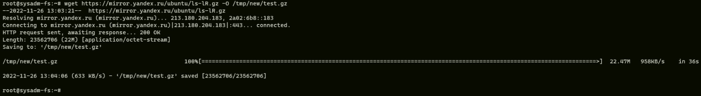

14.Прикрепите вывод lsblk.
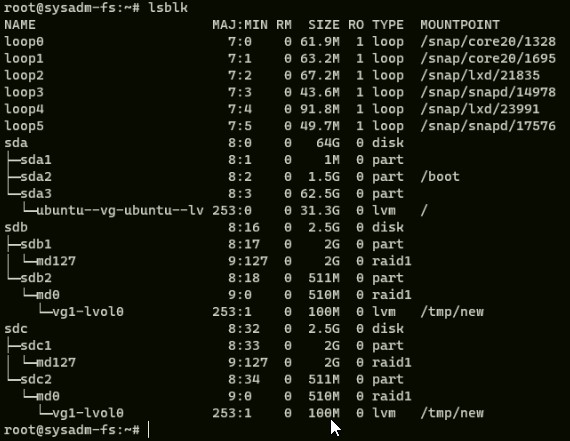
15.Протестируйте целостность файла: 

`root@vagrant:~# gzip -t /tmp/new/test.gz
root@vagrant:~# echo $?
0
`
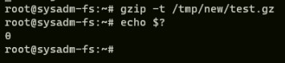

16.Используя pvmove, переместите содержимое PV с RAID0 на RAID1.

_Было:_
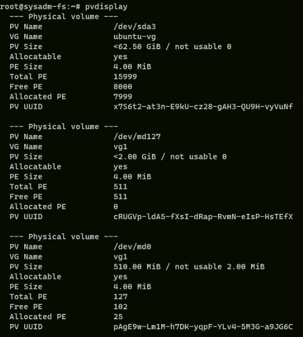
_перемещаем:_

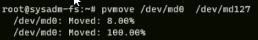,

_стало:_
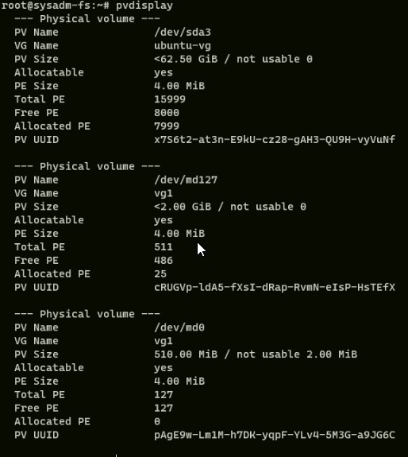

17.Сделайте --fail на устройство в вашем RAID1 md.

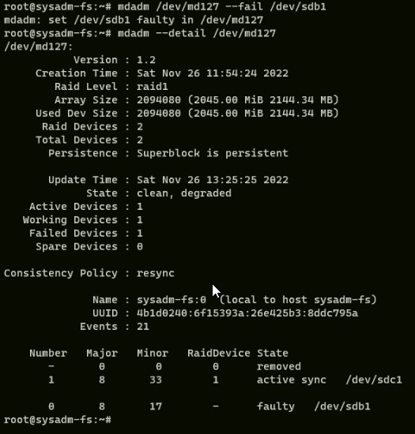

18.Подтвердите выводом dmesg, что RAID1 работает в деградированном состоянии.

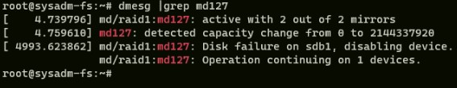

19.Протестируйте целостность файла, несмотря на "сбойный" диск он должен продолжать быть доступен:

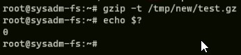

20.Погасите тестовый хост, vagrant destroy.

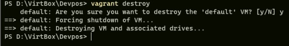