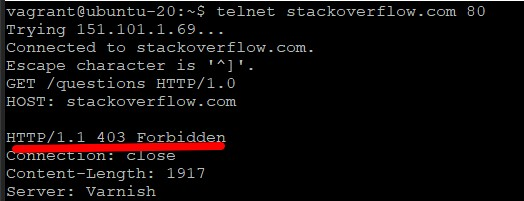
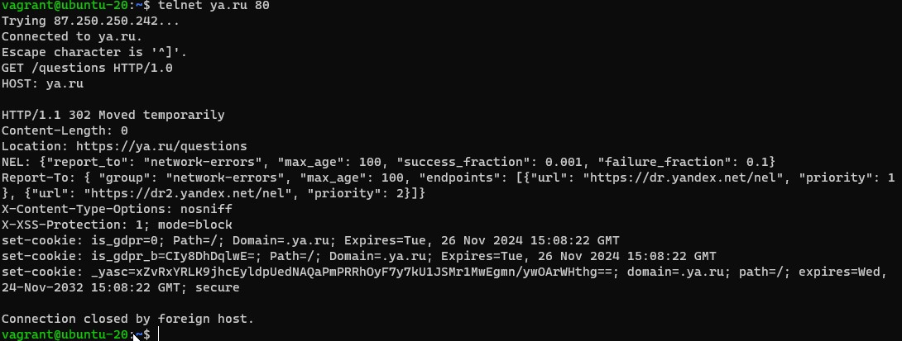
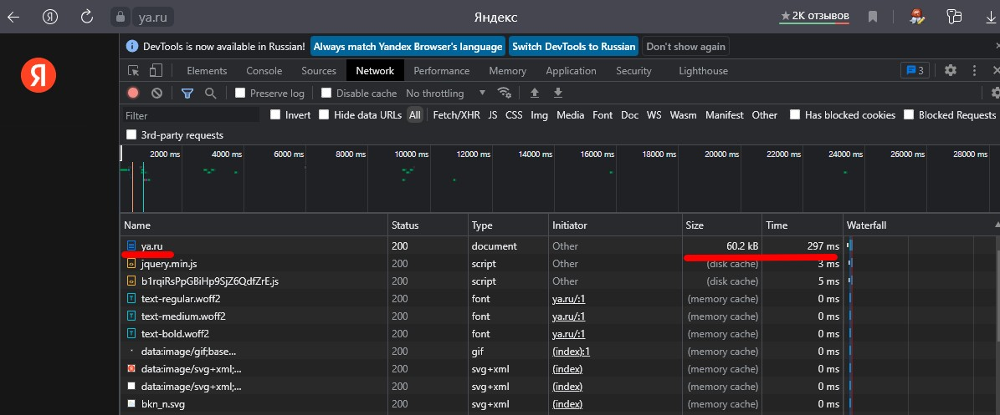
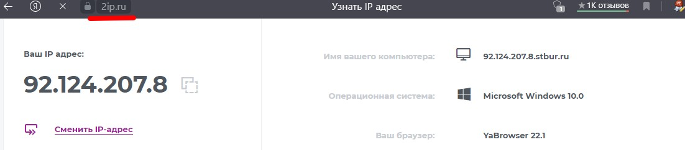
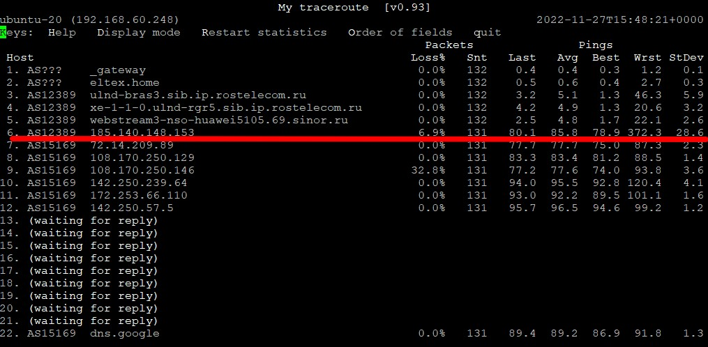
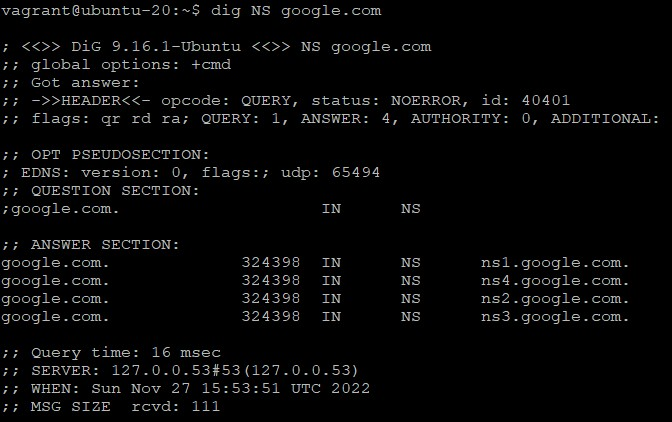
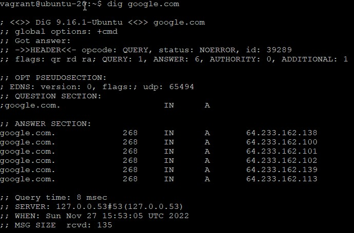
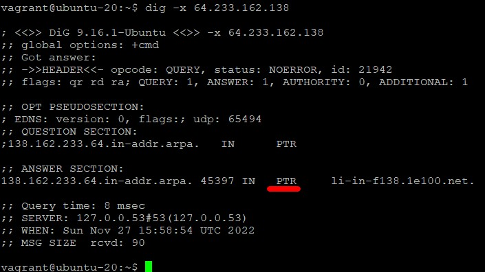

# Домашнее задание к занятию "3.6. Компьютерные сети. Лекция 1"

## Чеклист готовности к домашнему заданию

Убедитесь, что у вас установлены необходимые сетевые утилиты - dig, traceroute, mtr, telnet.
Полезным дополнением к обозначенным выше утилитам будет пакет net-tools. Установить его можно с помощью команды apt install net-tools.
RFC протокола HTTP/1.0, в частности страница с кодами ответа.
Ссылки на остальные RFC для HTTP.

## Задание

1.Работа c HTTP через телнет.
* Подключитесь утилитой телнет к сайту stackoverflow.com telnet stackoverflow.com 80
* Отправьте HTTP запрос
`GET /questions HTTP/1.0
HOST: stackoverflow.com
[press enter]
[press enter]`

В ответе укажите полученный HTTP код, что он означает?
Так как telnet вызовы на stackoverflow.com вызывают ошибку с кодом 403 - запрещен, делаю вывод, что мой российский адрес заблокирован
_This IP address (92.124.207.8) has been blocked from access to our services._

Поэтому решил сменить адрес на российский сервис

_Означает, что (HTTP/1.1 302 Moved temporarily) сайт временно перемещен на Location: https://ya.ru/questions_

2.Повторите задание 1 в браузере, используя консоль разработчика F12.
* откройте вкладку Network
* отправьте запрос http://stackoverflow.com
* найдите первый ответ HTTP сервера, откройте вкладку Headers
* укажите в ответе полученный HTTP код
* проверьте время загрузки страницы, какой запрос обрабатывался дольше всего?
* приложите скриншот консоли браузера в ответ.

_Первый ответ HTTP сервера:
Request URL: https://ya.ru/portal/set/any?sk=y51530fe3528097b540c5f59b49bae97f&gif=1&szm=1:1920x1080:1317x964
Request Method: GET
Status Code: 302 
Remote Address: 87.250.250.242:443
Referrer Policy: origin_

_Дольше обрабатывался первый запрос_

3.Какой IP адрес у вас в интернете?

_Использовал сервис 2ip.ru_

4.Какому провайдеру принадлежит ваш IP адрес? Какой автономной системе AS? Воспользуйтесь утилитой `whois`

`netname:        WEBSTREAM
descr:          OJSC "Sibirtelecom"
origin:         AS12389`

5.Через какие сети проходит пакет, отправленный с вашего компьютера на адрес 8.8.8.8? Через какие AS? Воспользуйтесь утилитой `traceroute`

`traceroute to 8.8.8.8 (8.8.8.8), 30 hops max, 60 byte packets
 1  192.168.60.1 [*]  0.621 ms  0.594 ms  0.611 ms
 2  192.168.1.1 [*]  0.992 ms  1.126 ms  1.223 ms
 3  213.228.116.203 [AS12389]  5.492 ms  5.479 ms  5.480 ms
 4  213.228.114.4 [AS12389]  12.762 ms  12.941 ms  12.735 ms
 5  213.228.114.69 [AS12389]  10.451 ms  10.247 ms  14.682 ms
 6  * * *
 7  72.14.209.89 [AS15169]  79.850 ms  77.631 ms  77.383 ms
 8  * * *
 9  172.253.69.166 [AS15169]  83.157 ms 108.170.250.33 [AS15169]  80.022 ms 108.170.225.44 [AS15169]  80.879 ms
10  108.170.250.66 [AS15169]  82.602 ms 108.170.250.83 [AS15169]  86.013 ms 108.170.250.113 [AS15169]  85.556 ms
11  142.250.239.64 [AS15169]  105.636 ms 142.251.238.82 [AS15169]  95.674 ms 142.250.238.214 [AS15169]  102.247 ms
12  72.14.232.190 [AS15169]  94.592 ms  96.877 ms 74.125.253.94 [AS15169]  105.983 ms
13  216.239.58.69 [AS15169]  106.491 ms 172.253.79.237 [AS15169]  92.739 ms 209.85.251.63 [AS15169]  94.039 ms
14  * * *
15  * * *
16  * * *
17  * * *
18  * * *
19  * * *
20  * 8.8.8.8 [AS15169]  93.913 ms *
vagrant@ubuntu-20:~$
`

6.Повторите задание 5 в утилите mtr. На каком участке наибольшая задержка - delay?

_vagrant@ubuntu-20:~$ mtr -z 8.8.8.8

7.Какие DNS сервера отвечают за доменное имя dns.google? Какие A записи? Воспользуйтесь утилитой dig

_DNS сервера_

_А-записи_

8.Проверьте PTR записи для IP адресов из задания 7. Какое доменное имя привязано к IP? Воспользуйтесь утилитой dig

_К IP-адресу 138.162.233.64. привязано доменное имя  li-in-f138.1e100.net_