# Домашнее задание к занятию "3.7. Компьютерные сети.Лекция 2"

Цель задания
В результате выполнения этого задания вы:

Познакомитесь с инструментами настройки сети в Linux, агрегации нескольких сетевых интерфейсов, отладки их работы.
Примените знания о сетевых адресах на практике для проектирования сети.
Инструкция к заданию
Создайте .md-файл для ответов на задания в своём репозитории, после выполнения прикрепите ссылку на него в личном кабинете.
Любые вопросы по выполнению заданий спрашивайте в чате учебной группы и/или в разделе “Вопросы по заданию” в личном кабинете.
Инструменты/ дополнительные материалы, которые пригодятся для выполнения задания
Калькулятор сетей online.
Калькулятор сетей программа - ipcalc (apt install ipcalc), если есть графический интерфейс, то у программы калькулятора есть инженерный режим, там можно и сети считать.

## Задание

1.Проверьте список доступных сетевых интерфейсов на вашем компьютере. Какие команды есть для этого в Linux и в Windows?

_linux_
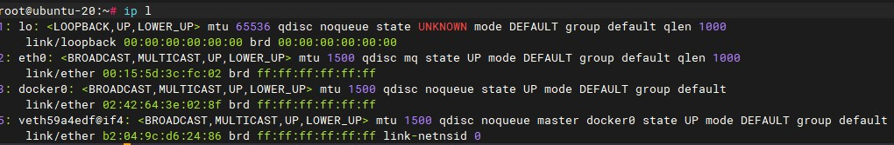

_windows_
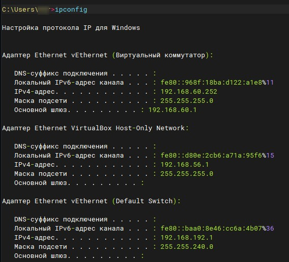

2.Какой протокол используется для распознавания соседа по сетевому интерфейсу? Какой пакет и команды есть в Linux для этого?

_Протокол LLDP. Пакет lldpd. Команда lldpctl, lldpcli._
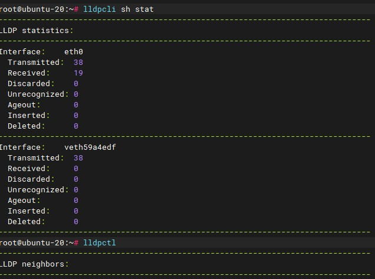

_команда `ip neigh` Shows the current neighbour table in kernel._
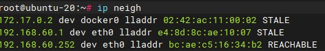

3.Какая технология используется для разделения L2 коммутатора на несколько виртуальных сетей? Какой пакет и команды есть в Linux для этого? Приведите пример конфига.

_Для разделения L2 коммутатора на несколько виртуальных сетей используется VLAN. В Linux для этого есть пакет vlan. После его установки в Ubuntu нужно настроить конфиг файл /etc/netplan/*.yaml_

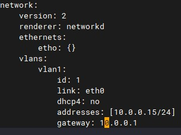

4.Какие типы агрегации интерфейсов есть в Linux? Какие опции есть для балансировки нагрузки? Приведите пример конфига.

_В Linux есть две технологии агрегации: bond и team. На практике применял bond в настройке Cloud Hosted Router.
Для балансировки нагрузки используют значения `balance-tlb` или `balance-alb` параметра mode._

_Пример конфига:_
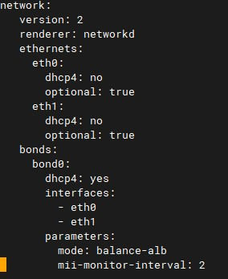

5.Сколько IP адресов в сети с маской /29 ? Сколько /29 подсетей можно получить из сети с маской /24. Приведите несколько примеров /29 подсетей внутри сети 10.10.10.0/24.

_Количество доступных адресов - 8. Количество рабочих адресов для хостов - 6. Сеть с маской /24 можно разбить на 32 подсети с маской /29.
Примеры:_

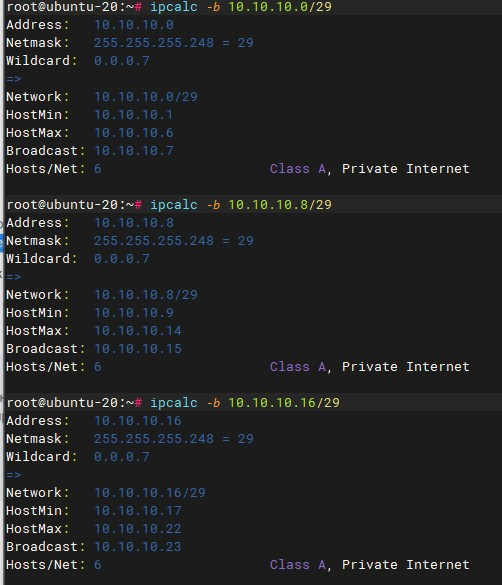

6.Задача: вас попросили организовать стык между 2-мя организациями. Диапазоны 10.0.0.0/8, 172.16.0.0/12, 192.168.0.0/16 уже заняты. Из какой подсети допустимо взять частные IP адреса? Маску выберите из расчета максимум 40-50 хостов внутри подсети.

_К частным "серым" адресам относятся IP-адреса из следующих подсетей:
От 10.0.0.0 до 10.255.255.255 с маской 255.0.0.0 или /8
От 172.16.0.0 до 172.31.255.255 с маской 255.240.0.0 или /12
От 192.168.0.0 до 192.168.255.255 с маской 255.255.0.0 или /16
От 100.64.0.0 до 100.127.255.255 с маской подсети 255.192.0.0 или /10; данная подсеть рекомендована согласно rfc6598 для использования в качестве адресов для CGN (Carrier-Grade NAT)_

_Так как 3 первых диапазона заняты, можно использовать диапазон 100.64.0.0/10_
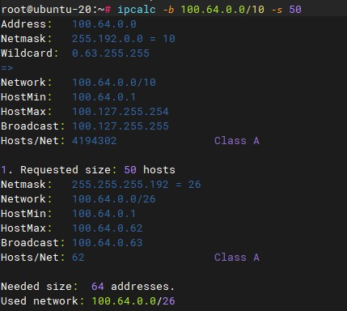

_Маску нужно выбрать /26_

7.Как проверить ARP таблицу в Linux, Windows? Как очистить ARP кеш полностью? Как из ARP таблицы удалить только один нужный IP?

**_Проверить ARP таблицу в Linux, Windows_**

_Linux_
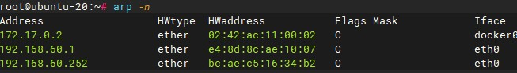

_Windows_
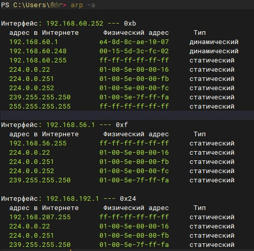

_**Очистить ARP кеш полностью:**_

_Linux_
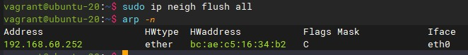

_Windows_

`netsh interface ip delete arpcache` _с админскими правами, чистит ARP кеш полностью_

_**Как из ARP таблицы удалить только один нужный IP**
Linux_
`arp -d IP_addr` 
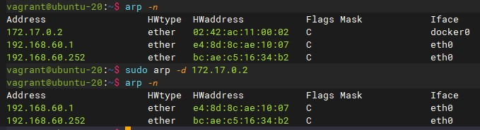

_Windows_
`arp -d IP_addr` _Удаляет узел._

