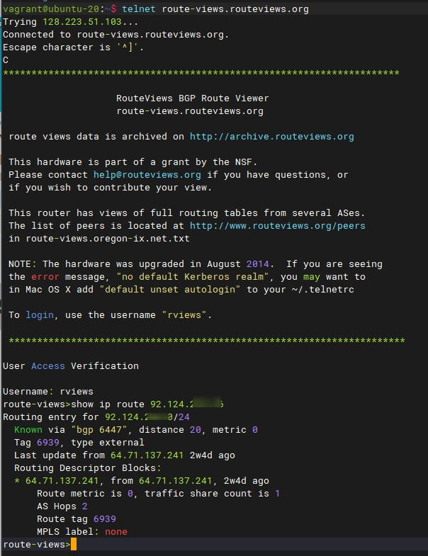
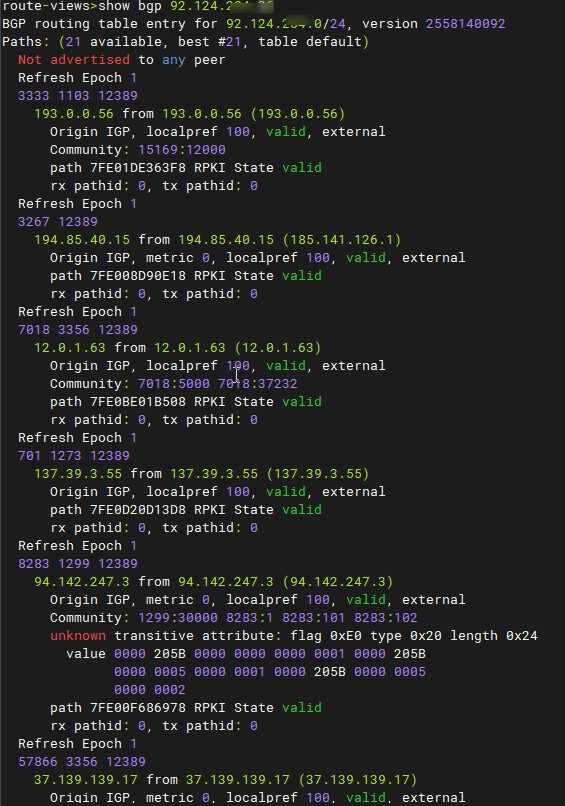
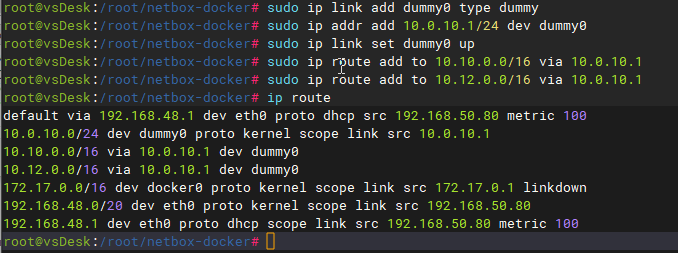
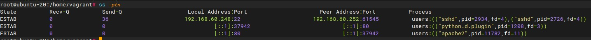
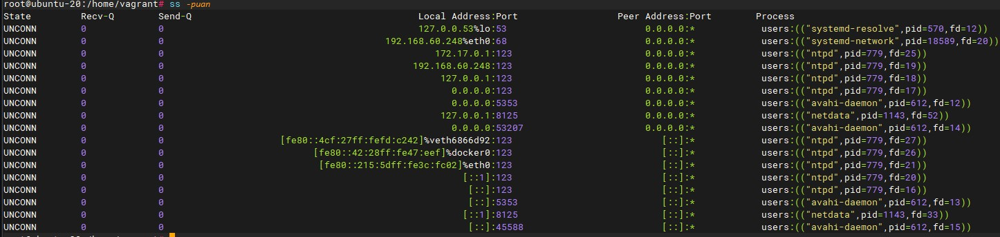
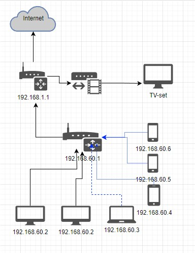

# Домашнее задание к занятию "3.8. Компьютерные сети, лекция 3"

### Цель задания

В результате выполнения этого задания вы:

1.На практике познакомитесь с маршрутизацией в сетях, что позволит понять устройство больших корпоративных сетей и интернета.
2.Проверите TCP/UDP соединения на хосте (это обычный этап отладки сетевых проблем).
3.Построите сетевую диаграмму.

### Чеклист готовности к домашнему заданию

1.Убедитесь, что у вас установлен telnet.
2.Воспользуйтесь пакетным менеджером apt для установки.

### Инструменты/ дополнительные материалы, которые пригодятся для выполнения задания
1.Зачем нужны dummy интерфейсы
## Задание

1.Подключитесь к публичному маршрутизатору в интернет. Найдите маршрут к вашему публичному IP
`telnet route-views.routeviews.org
Username: rviews
show ip route x.x.x.x/32
show bgp x.x.x.x/32`

_Рекомендованные команды не сработали:_

_Убрал маску:_

2.Создайте dummy0 интерфейс в Ubuntu. Добавьте несколько статических маршрутов. Проверьте таблицу маршрутизации.

3.Проверьте открытые TCP порты в Ubuntu, какие протоколы и приложения используют эти порты? Приведите несколько примеров.

_Использовал утилиту ss  с ключами -p - процессы, t - TCP, n - показывает не имя, а номер порта_

4.Проверьте используемые UDP сокеты в Ubuntu, какие протоколы и приложения используют эти порты?

_UDP порты в состоянии unconnected_

5.Используя diagrams.net, создайте L3 диаграмму вашей домашней сети или любой другой сети, с которой вы работали.

В качестве решения ответьте на вопросы, опишите, каким образом эти ответы были получены и приложите по неоходимости скриншоты

## Задание для самостоятельной отработки* (необязательно к выполнению)
6.Установите Nginx, настройте в режиме балансировщика TCP или UDP.

7.Установите bird2, настройте динамический протокол маршрутизации RIP.

8.Установите Netbox, создайте несколько IP префиксов, используя curl проверьте работу API.

