# Домашнее задание к занятию "3.9. Элементы безопасности информационных систем"

## Задание
1.Установите Bitwarden плагин для браузера. Зарегистрируйтесь и сохраните несколько паролей.

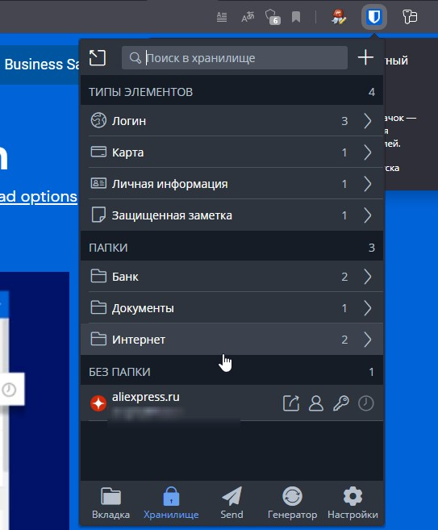

2.Установите Google authenticator на мобильный телефон. Настройте вход в Bitwarden акаунт через Google authenticator OTP.

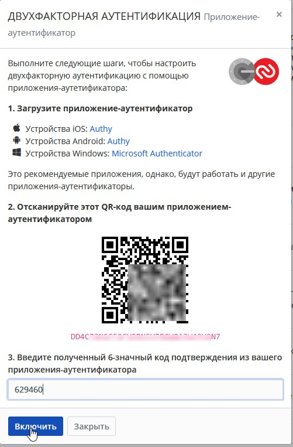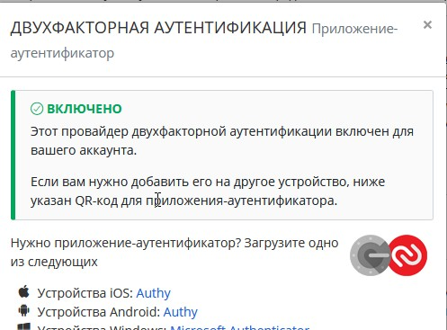

3.Установите apache2, сгенерируйте самоподписанный сертификат, настройте тестовый сайт для работы по HTTPS.

`$ sudo apt install apache2`
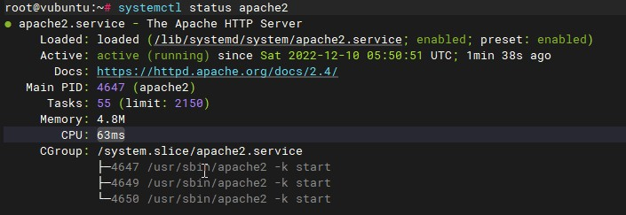

_Создание сертификата SSL_

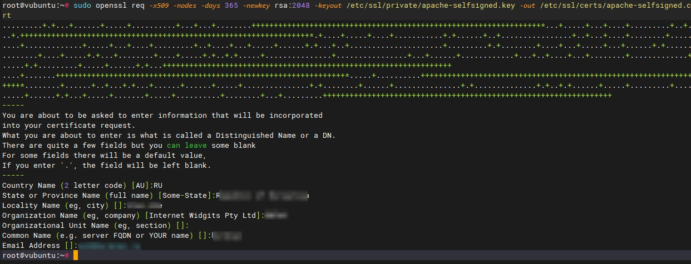

_Настройка Apache для использования SSL_

`root@vubuntu:~# sudo cp /etc/apache2/sites-available/default-ssl.conf /etc/apache2/sites-available/default-ssl.conf.bak`

_Создание сниппета конфигурации Apache с надежными настройками шифрования_

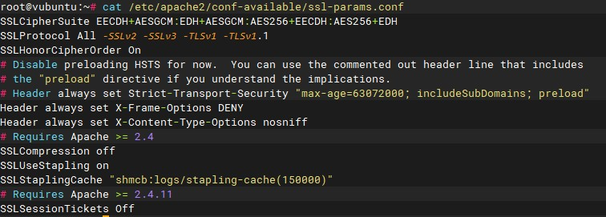

_Изменение файла виртуального хоста Apache SSL по умолчанию_
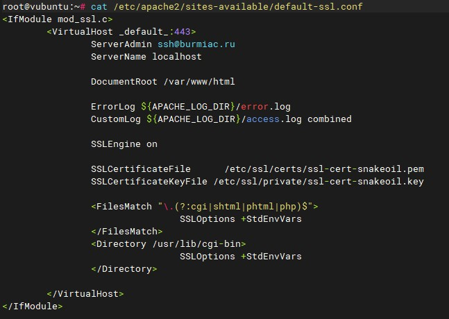

_Перенаправления всего трафика для шифрования SSL_
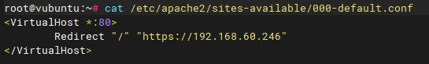

_Активация изменений в Apache_
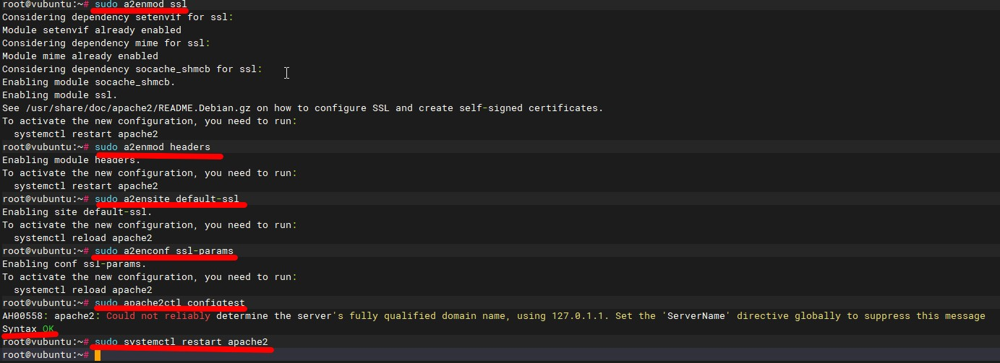

_Тестовый сайт для работы по HTTPS_

4.Проверьте на TLS уязвимости произвольный сайт в интернете (кроме сайтов МВД, ФСБ, МинОбр, НацБанк, РосКосмос, РосАтом,
РосНАНО и любых госкомпаний, объектов КИИ, ВПК ... и тому подобное).

_Использую утилиту из лекции_
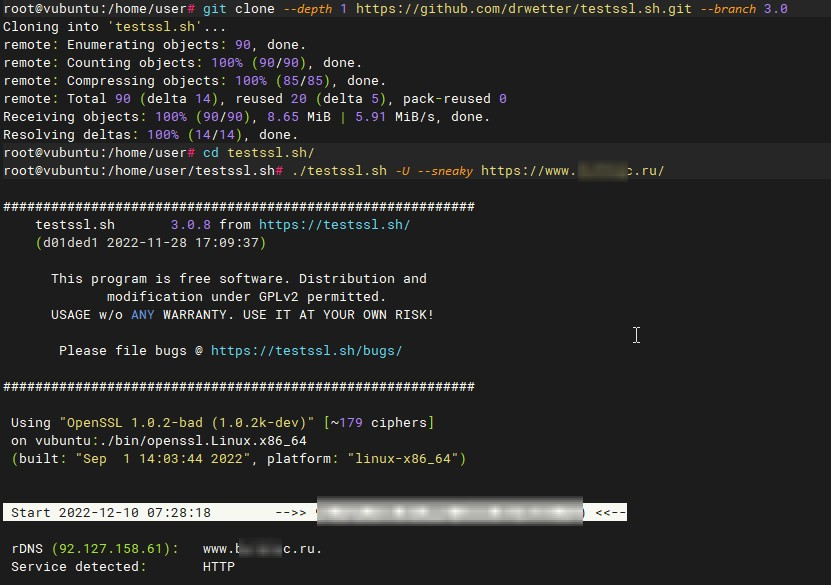

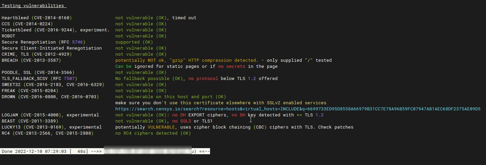

5.Установите на Ubuntu ssh сервер, сгенерируйте новый приватный ключ. Скопируйте свой публичный ключ на другой сервер. Подключитесь к серверу по SSH-ключу.

_ssh сервер установлен по умолчанию. Генерирую ключ_ 
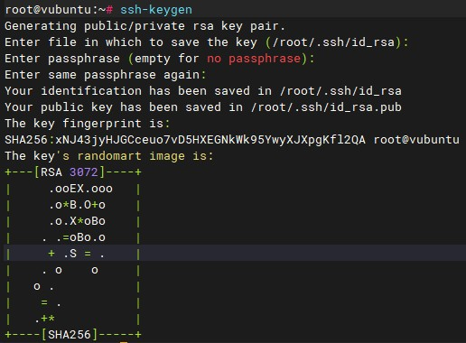

_Копирую на другой сервер и подключаюсь_
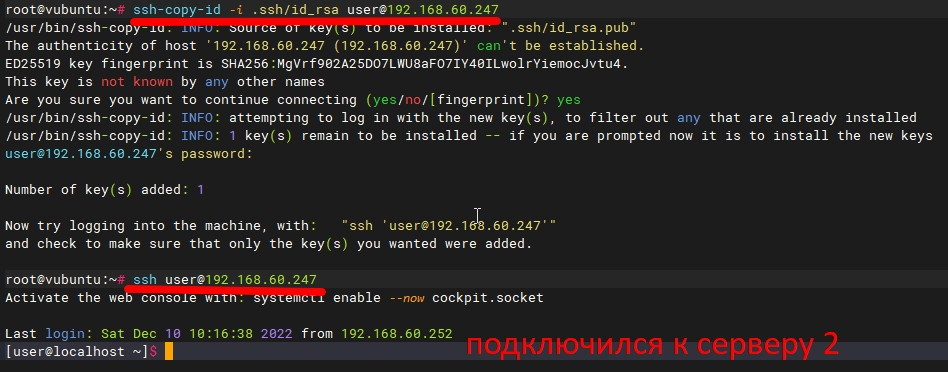

6.Переименуйте файлы ключей из задания 5. Настройте файл конфигурации SSH клиента, так чтобы вход на удаленный сервер осуществлялся по имени сервера.

`root@vubuntu:~# mv ~/.ssh/id_rsa ~/.ssh/id_rsa_ubuntu`

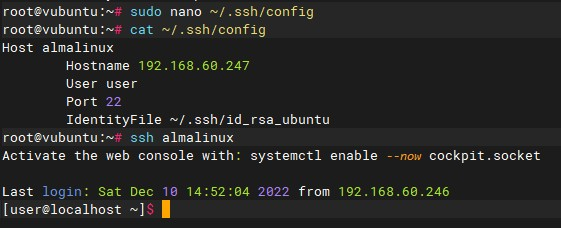

7.Соберите дамп трафика утилитой tcpdump в формате pcap, 100 пакетов. Откройте файл pcap в Wireshark.

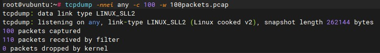