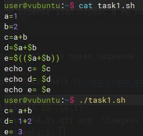
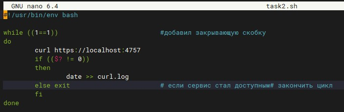
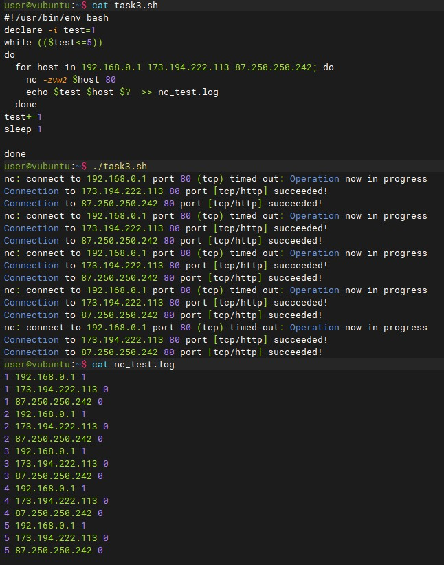
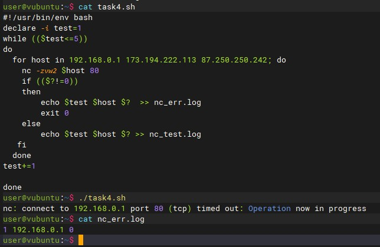

# Домашнее задание к занятию "4.1. Командная оболочка Bash: Практические навыки"

## Задание 1

Есть скрипт:
`a=1
b=2
c=a+b
d=$a+$b
e=$(($a+$b))`
Какие значения переменным c,d,e будут присвоены? Почему?

Переменная	|Значение	|Обоснование

c			| a+b		| a и b воспринимаются как текст без $, + не в арифметических выражениях также как текст
d			|1+2		| a и b воспринимаются как переменные и возвратили значение, но выражение не было заключено в скобки, поэтому сложения не получилось
e			|3			|возврат суммы переменных

### Задание 2

На нашем локальном сервере упал сервис и мы написали скрипт, который постоянно проверяет его доступность, записывая дату проверок до тех пор, пока сервис не станет доступным (после чего скрипт должен завершиться). В скрипте допущена ошибка, из-за которой выполнение не может завершиться, при этом место на Жёстком Диске постоянно уменьшается. Что необходимо сделать, чтобы его исправить:

`while ((1==1)
do
	curl https://localhost:4757
	if (($? != 0))
	then
		date >> curl.log
	fi
done`

Мой скрипт:

## Задание 3
Необходимо написать скрипт, который проверяет доступность трёх IP: 192.168.0.1, 173.194.222.113, 87.250.250.242 по 80 порту и записывает результат в файл log. Проверять доступность необходимо пять раз для каждого узла.

Мой скрипт:

## Задание 4

Необходимо дописать скрипт из предыдущего задания так, чтобы он выполнялся до тех пор, пока один из узлов не окажется недоступным. Если любой из узлов недоступен - IP этого узла пишется в файл error, скрипт прерывается.

Мой скрипт:

### Дополнительное задание (со звездочкой*) - необязательно к выполнению

Мы хотим, чтобы у нас были красивые сообщения для коммитов в репозиторий. Для этого нужно написать локальный хук для git, который будет проверять, что сообщение в коммите содержит код текущего задания в квадратных скобках и количество символов в сообщении не превышает 30. Пример сообщения: [04-script-01-bash] сломал хук.

Ваш скрипт: