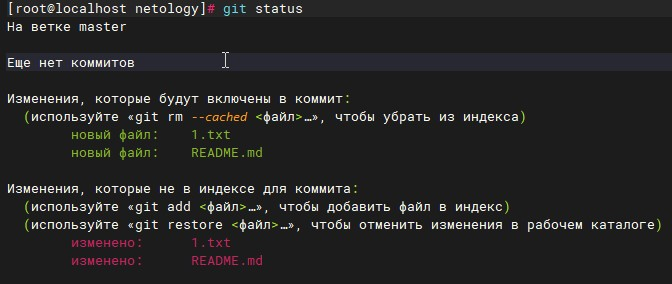
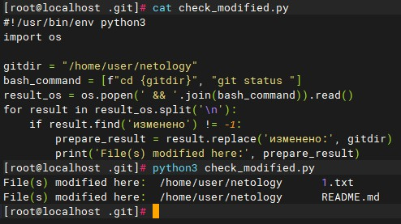
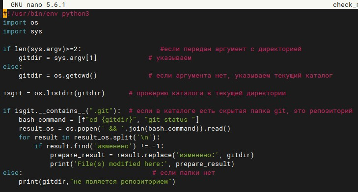
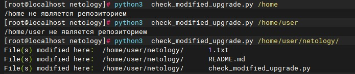
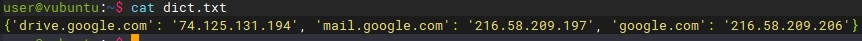
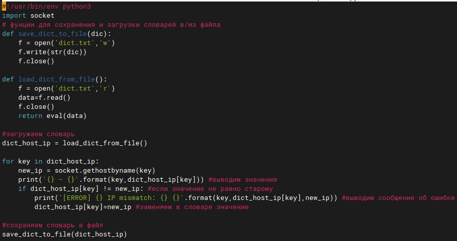
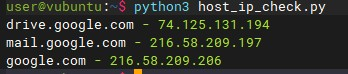
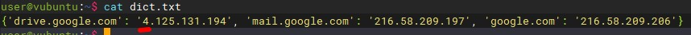
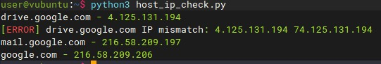

# Домашнее задание к занятию "4.2. Использование Python для решения типовых DevOps задач"

### Цель задания

В результате выполнения этого задания вы:

1. Познакомитесь с синтаксисом Python.
2. Узнаете, для каких типов задач его можно использовать.
3. Воспользуетесь несколькими модулями для работы с ОС.

### Инструкция к заданию

Установите Python 3 любой версии.
Скопируйте в свой .md-файл содержимое этого файла; исходники можно посмотреть здесь.
Заполните недостающие части документа решением задач (заменяйте ???, остальное в шаблоне не меняйте, чтобы не сломать форматирование текста, подсветку синтаксиса). Вместо логов можно вставить скриншоты по желанию.
Для проверки домашнего задания преподавателем в личном кабинете прикрепите и отправьте ссылку на решение в виде md-файла в вашем Github.
Любые вопросы по выполнению заданий спрашивайте в чате учебной группы и/или в разделе “Вопросы по заданию” в личном кабинете.

## Задание 1

Есть скрипт:

```sh
a = 1
b = '2'
c = a + b
```

### Вопросы:
Вопрос	Ответ

Какое значение будет присвоено переменной c	

Выдаст ошибку, так как разные типы данных.


Как получить для переменной c значение 12

Перевести первое значение в строку. Сложить две строки. 


Как получить для переменной c значение 3

Перевести второе значение в число и сложить 1+2.


## Задание 2
Мы устроились на работу в компанию, где раньше уже был DevOps Engineer. Он написал скрипт, позволяющий узнать, какие файлы модифицированы в репозитории, относительно локальных изменений. Этим скриптом недовольно начальство, потому что в его выводе есть не все изменённые файлы, а также непонятен полный путь к директории, где они находятся.

Как можно доработать скрипт ниже, чтобы он исполнял требования вашего руководителя?
```sh
#!/usr/bin/env python3

import os

bash_command = ["cd ~/netology/sysadm-homeworks", "git status"]
result_os = os.popen(' && '.join(bash_command)).read()
is_change = False
for result in result_os.split('\n'):
    if result.find('modified') != -1:
        prepare_result = result.replace('\tmodified:   ', '')
        print(prepare_result)
        break
```
Ваш скрипт:



Git у меня разговаривает по-русски, поэтому изменил строку поиска 'modified' на 'изменено: ', убрал непонятную переменную is_change и директиву break на тот случай, если измененных файлов больше 1.



## Задание 3
Доработать скрипт выше так, чтобы он не только мог проверять локальный репозиторий в текущей директории, но и умел воспринимать путь к репозиторию, который мы передаём как входной параметр. Мы точно знаем, что начальство коварное и будет проверять работу этого скрипта в директориях, которые не являются локальными репозиториями.

### Ваш скрипт:



### Вывод скрипта при запуске при тестировании:



## Задание 4
Наша команда разрабатывает несколько веб-сервисов, доступных по http. Мы точно знаем, что на их стенде нет никакой балансировки, кластеризации, за DNS прячется конкретный IP сервера, где установлен сервис.
Проблема в том, что отдел, занимающийся нашей инфраструктурой очень часто меняет нам сервера, поэтому IP меняются примерно раз в неделю, при этом сервисы сохраняют за собой DNS имена. Это бы совсем никого не беспокоило, если бы несколько раз сервера не уезжали в такой сегмент сети нашей компании, который недоступен для разработчиков.
Мы хотим написать скрипт, который:
* опрашивает веб-сервисы,
* получает их IP,
* выводит информацию в стандартный вывод в виде: <URL сервиса> - <его IP>.
Также, должна быть реализована возможность проверки текущего IP сервиса c его IP из предыдущей проверки. Если проверка будет провалена - оповестить об этом в стандартный вывод сообщением: [ERROR] <URL сервиса> IP mismatch: <старый IP> <Новый IP>. Будем считать, что наша разработка реализовала сервисы: drive.google.com, mail.google.com, google.com.

### Ваш скрипт:
_Создал словарь со значениями хост:IP. Сохранил его в файл_



_Скрипт загружает словарь из файла, проверяет текущие значения IP, выводит значения, сообщает если ошибка, сохраняет новые значения. 



### Вывод скрипта при запуске при тестировании:



_если IP для "drive.google.com" изменилось._ 



_оповещатель если проверка провалена 



