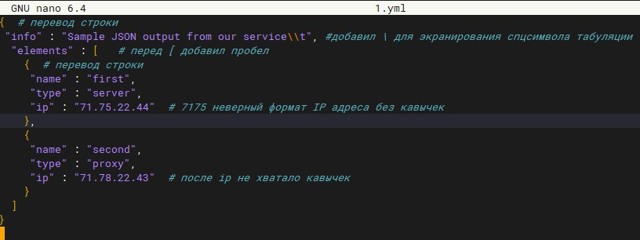
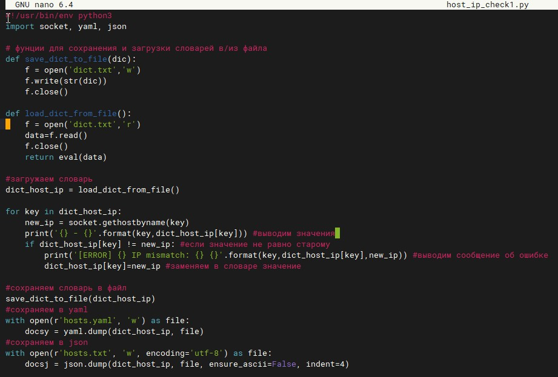
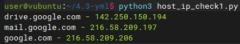
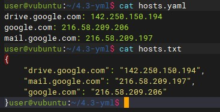

# Домашнее задание к занятию "4.3. Языки разметки JSON и YAML"

### Цель задания

В результате выполнения этого задания вы:

Познакомитесь с синтаксисами JSON и YAML.
Узнаете как преобразовать один формат в другой при помощи пары строк.

### Чеклист готовности к домашнему заданию

Установлена библиотека pyyaml для Python 3.

### Инструкция к заданию

Скопируйте в свой .md-файл содержимое этого файла; исходники можно посмотреть здесь.
Заполните недостающие части документа решением задач (заменяйте ???, остальное в шаблоне не меняйте, чтобы не сломать форматирование текста, подсветку синтаксиса и прочее) и отправляйте на проверку. Вместо логов можно вставить скриншоты по желанию.
Любые вопросы по выполнению заданий спрашивайте в чате учебной группы и/или в разделе “Вопросы по заданию” в личном кабинете.

## Задание 1

### Обязательная задача 1

Мы выгрузили JSON, который получили через API запрос к нашему сервису:

    { "info" : "Sample JSON output from our service\t",
        "elements" :[
            { "name" : "first",
            "type" : "server",
            "ip" : 7175 
            }
            { "name" : "second",
            "type" : "proxy",
            "ip : 71.78.22.43
            }
        ]
    }
Нужно найти и исправить все ошибки, которые допускает наш сервис

Ваш скрипт:

## Задание 2

В прошлый рабочий день мы создавали скрипт, позволяющий опрашивать веб-сервисы и получать их IP. К уже реализованному функционалу нам нужно добавить возможность записи JSON и YAML файлов, описывающих наши сервисы. Формат записи JSON по одному сервису: { "имя сервиса" : "его IP"}. Формат записи YAML по одному сервису: - имя сервиса: его IP. Если в момент исполнения скрипта меняется IP у сервиса - он должен так же поменяться в yml и json файле.

### Ваш скрипт:

### Вывод скрипта при запуске при тестировании:

### yml-файл(ы), json-файл(ы), который(е) записал ваш скрипт:

